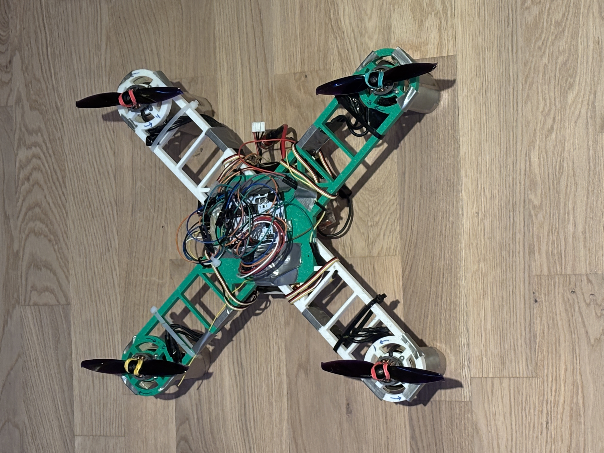
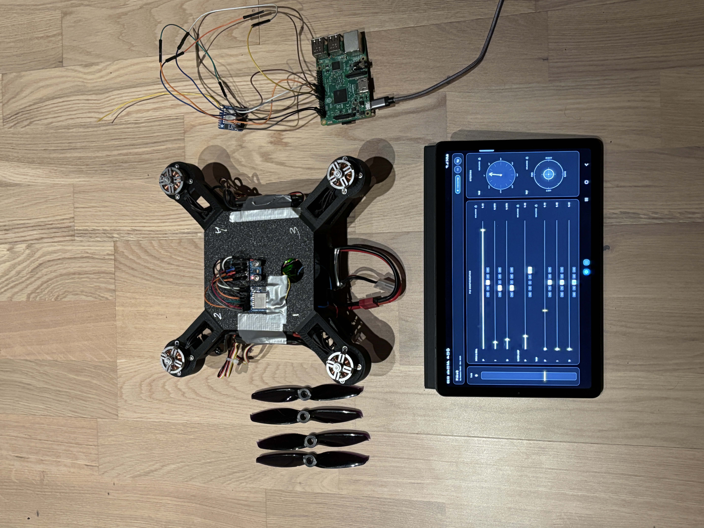

# Drone Control System

This repository contains all code developed for our Swedish upper-secondary _Gymnasiearbete_ project.  
The system implements a complete communication chain for controlling a quadcopter using BLE, LoRa, and an onboard IMU-based flight controller.

All programming in this repository was developed by **Hannes Göök**.

## Repository Structure

```
arduino_rx_drone_control/
mobile_app_2_raspberry/
raspberry_2_arduino/
```

## System Overview

### 1. Mobile App to Raspberry Pi

A Flutter app that sends joystick values, throttle, and PID parameters over BLE.

### 2. Raspberry Pi to Arduino

The Raspberry Pi receives BLE packets, bridges them through LoRa, and transmits them to the Arduino flight controller.

### 3. Arduino Flight Controller

The Arduino receives LoRa packets, parses control inputs, reads IMU data (MPU6050), runs a Madgwick filter, computes PID corrections, and drives four ESCs for quadcopter stabilization.

## Quadcopter Prototype



## Full System Setup



## Status

The system has been tested on a real quadcopter built together with my project partners, and is able to take off and fly under manual control from the mobile app.

Due to a simple frame design, limited mechanical tuning, and non-final PID parameters, the quadcopter is not perfectly stable and tends to spin. The controller is intended as a working prototype rather than a production-grade flight controller.

## Dependencies and Notes

This project relies on a modified version of the RadioHead library.

Changes made:
- The file `RH_ASK.cpp` was disabled (renamed to `RH_ASK.cpp.disabled`) to avoid conflicts with the LoRa module.
- Atomic sections (`ATOMIC_BLOCK_START` / `ATOMIC_BLOCK_END`) were removed in `RHSPIDriver.cpp` to prevent blocking behavior that interfered with motor timing.

These changes were required to ensure stable real-time motor control.

## Mobile App Notes

The mobile app is provided as Flutter source code (`mobile_app_2_raspberry/lib/main.dart`) together with dependency definitions. Platform-specific files can be generated using `flutter create`.

## License

This project is licensed under the MIT License.
See the `LICENSE` file for details.
